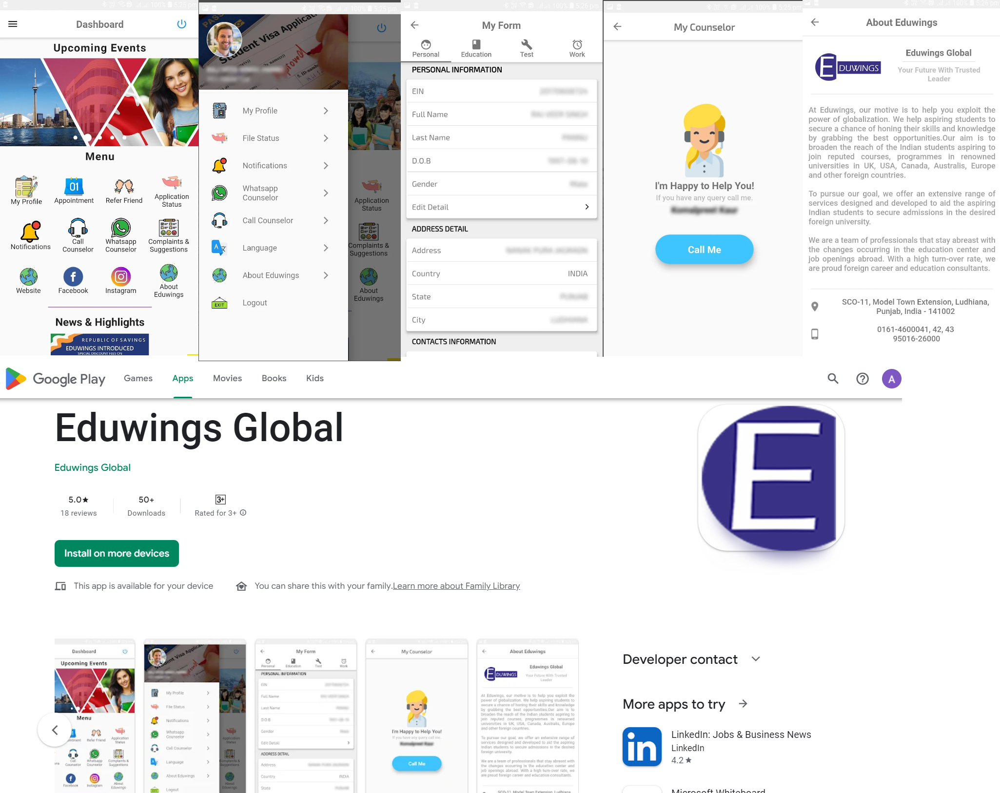

# Eduwings Global

Eduwings Global is a Flutter-based application developed for Eduwings Global, a leading immigration and education consulting company. The app offers authentication features, enabling users to securely access personalized services. Additionally, it provides functionalities such as live class conduction, assignment management, and interactive platforms for teachers and students. 

## Download

[Download Eduwings Global on Google Play](https://apkpure.com/eduwings-global/com.eduwingserp.studentapp)

## Contact Me

I'm always interested in new opportunities and collaborations. Feel free to reach out to me through the following channels:

- **Email:** [kanwer@sheridancollege.ca](mailto:kanwer@sheridancollege.ca)
- **LinkedIn:** [Arpan Kanwer](https://www.linkedin.com/in/arpankanwe/)
- **Github:** [Arpan Kanwer](https://github.com/arpankanwer/)
- **Personal Website:** [Arpan Kanwer](https://arpankanwer.tech/)

Let's connect and create something amazing together!